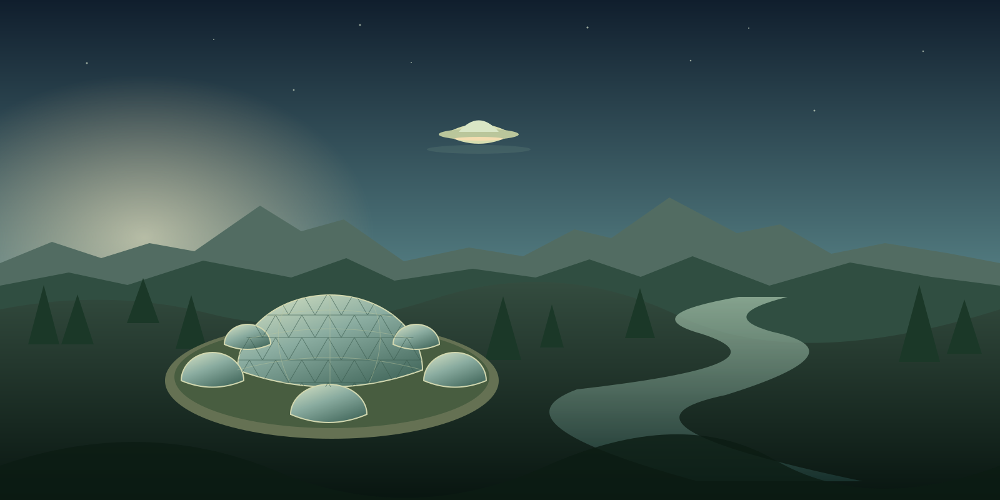

# Equirectangular Cinemagraph Creator

**Give a still panorama a little life.** Select a square region, remix its image, animate it, and blend it back into a full 360° scene. Combine scenes and moving regions, add narration and music, and export a spherical MP4.

[Website & selection demo](https://equirectangular-cinemagraph-creator.netlify.app) · [Getting started](#getting-started) · [How to use it](#how-to-use-it) · [Troubleshooting](#troubleshooting)



> **Where it runs:** Netlify hosts the public guide and selection demo. The complete studio runs on **your computer**, using Docker or Node.js + FFmpeg. Start it before opening [localhost:4317](http://localhost:4317). This release is a local, single-user application, not a shared cloud rendering service.

## Features

| Tool | What it does |
| --- | --- |
| Lasso / square | Draw around a detail; the lasso becomes a square crop. Shift the seam to reach boundary areas. |
| OpenAI image remix | Add objects, change details or add a worldspace UI. Export an updated equirectangular PNG. |
| Transparent PNG overlays | Upload or generate cutouts, drag/resize/stack them over the panorama, and preserve their alpha when compositing. |
| Grok / xAI video | Animate the selected region or remix an existing short clip, then composite it into the panorama. |
| Multiple regions and scenes | Layer several moving regions on one panorama, or trim and reorder full 360° scenes into a film. |
| ElevenLabs sound | Generate narration, effects and instrumental music; arrange and mix them in the same editor. |
| FFmpeg export | Feather edges, build loops, mix audio and write H.264 MP4 files with spherical metadata. |

**Bring your own keys.** Add only the services you use. Importing images, clips and audio and stitching them locally requires no AI account. Provider generation is billed to your own account.

## Getting started

### Docker (recommended)

Install [Git](https://git-scm.com/downloads) and [Docker](https://docs.docker.com/get-started/get-docker/). Start Docker Desktop if you use it. Docker includes Node.js and FFmpeg inside the image.

```sh
git clone https://github.com/pdxor/equirectangular-cinemagraph-creator.git
cd equirectangular-cinemagraph-creator
```

Alternatively, choose GitHub **Code → Download ZIP**, extract it, and open a terminal inside the folder.

#### Windows PowerShell

```powershell
.\start.ps1
```

If PowerShell blocks scripts, use these commands. They preserve an existing `.env`:

```powershell
if (-not (Test-Path .env)) { Copy-Item .env.example .env }
if (-not (Test-Path data)) { New-Item -ItemType Directory data | Out-Null }
docker compose up --build -d
```

#### macOS / Linux

```sh
[ -f .env ] || cp .env.example .env
mkdir -p data
docker compose up --build -d
```

Open **[http://localhost:4317](http://localhost:4317)**. The first build takes a few minutes. Inspect startup with `docker compose logs -f`; stop with `docker compose down`. Your `.env` and `data/` stay in the project folder when the container stops.

On native Linux, the mounted `.env` and `data/` must be writable by the container's `node` user (UID 1000). Adjust those files' ownership if your local UID differs. Docker Desktop handles host sharing separately.

### Without Docker

Install **Node.js 22.12+** and **FFmpeg / FFprobe**. Both `ffmpeg -version` and `ffprobe -version` must work in your terminal. Clone or download the repository, then:

```sh
npm run setup
npm ci
npm run build
npm start
```

Open **[http://localhost:4317](http://localhost:4317)**. Setup creates `.env` only when absent; it never overwrites keys. Stop with Ctrl+C. Use `npm run dev` for development.

## Add your own API keys

Click **API settings** in the local studio, paste your keys and click **Save locally**. Blank password fields preserve saved keys. You can also edit `.env` directly. Changes load on the next request without rebuilding.

| Setting | Purpose | Account |
| --- | --- | --- |
| `OPENAI_API_KEY` | Image remixing | [OpenAI API keys](https://platform.openai.com/api-keys) |
| `XAI_API_KEY` | Video generation and remix | [xAI console](https://console.x.ai/) |
| `ELEVENLABS_API_KEY` | Speech, effects, music and voice listing | [ElevenLabs API keys](https://elevenlabs.io/app/settings/api-keys) |

API credits, model permissions and voice/music access are managed by each provider. Consumer chat subscriptions do not necessarily include API credits. Models and the default ElevenLabs voice are configurable in the dialog; see [`.env.example`](.env.example) for defaults.

**Privacy:** keys are plaintext in your local `.env`. Saved key values are never returned to the browser. The selected crop or clip goes to OpenAI/xAI when you generate; scripts and sound descriptions go to ElevenLabs. Netlify receives none of your keys or media. `.env`, projects and generated media are excluded from Git and Docker builds. To remove a key, empty its value in `.env`. Never place provider secrets in `VITE_*` variables or public build configuration.

## How to use it

### 1. Select a region

Upload a **full 2:1 equirectangular** PNG, JPG, WebP or TIFF (for example, 4096 × 2048). An ordinary wide photo does not become spherical by resizing. You can try the website's original [sample PNG](https://equirectangular-cinemagraph-creator.netlify.app/demo-panorama.png).

Draw with **Lasso** or **Square**. Use **Move**, arrow keys or the X / Y / Size fields for precision; Shift + arrow moves ten pixels. The **Seam** slider lets you reach a detail across the left/right boundary.

### Add transparent characters and objects

Open **Transparent PNG overlays** below the panorama. Upload a PNG cutout (up to 4096 × 4096), or describe a character/object and choose **Generate PNG** with your OpenAI key. Generation explicitly requests a transparent PNG. Upload your own character artwork for an exact likeness; a name alone does not define a custom character.

Click a library item to place it. In the **PNGs** tool, drag to move, drag the bottom-right corner to resize, or use arrow keys and the X/Y/width fields. Aspect ratio and alpha are preserved. You can adjust opacity and place up to 32 layers; later layers appear on top. Placement wraps across the panorama seam.

Choose **Merge PNGs into panorama** before video generation. This saves a new full-resolution image revision. Animate a different square to leave the character still, or select the character to animate it. In a multi-region scene, choose the merged revision as the base image. Existing scenes keep their selected base until you change it. Restore an earlier export to undo a merge. PNG originals stay in the library; unmerged placements are drafts and are not saved on project switches.

### 2. Remix the image

Enter an image prompt, then choose **Remix & export panorama**. Example:

> Add a small floating worldspace panel above the building. Keep the camera, sky, lighting and surrounding landscape unchanged.

Only the square goes to OpenAI. Its result is blended into the full-resolution PNG. Edits build on the current image; restore earlier images in **Exports**.

### 3. Animate or remix a clip

Describe motion and choose **Animate & export 360 MP4**, or chain both steps with **Remix image, then animate**. Example:

> The flying saucer vanishes in a brief poof of fine glitter. The glitter fades to an empty sky. Lock the camera and keep the landscape still.

Importing a square patch or clip lets you stitch without AI. Non-square clips are cropped to fill the selection. Grok video remix accepts clips up to 8.7 seconds; local stitching accepts up to 15 seconds.

Set feathering, optional edge color matching, output size, frame rate and a loop mode:

| Mode | Result |
| --- | --- |
| Crossfade | Blends the end into the start, shortening the clip by up to 0.75 seconds. |
| Ping-pong | Plays forward and backward, doubling the duration. |
| Original | Keeps the action without loop correction. |

A disappearing object returns at a loop boundary. For a story, use **Original** and follow it with a still scene using an image where the object is absent. AI output may need another prompt or take.

### 4. Build scenes and multiple moving regions

Open **Scenes & sound**. Add generated or imported 2:1 videos, trim start/duration and reorder with the arrow buttons. Choose **New region scene** to select a panorama revision and layer several clips onto it.

Each layer has square coordinates, start time, duration, edge blending and hold/repeat settings. Imported clips start at your current selection. Later layers cover earlier ones where they overlap. A region scene with no layers holds a still panorama. Scenes join with cuts.

### 5. Add sound

In **Narration & sound**, choose a voice and enter a script, describe an effect, or prompt instrumental music. Add an ElevenLabs key first. Search available voices or paste a voice ID.

Add sounds from the library to your film. Set start time, source trim, duration, volume, fades and repeat. Importing your own audio needs no key. Each generated sound is a separate provider request.

### 6. Export the film

Save the timeline. In **Review & export**, render the final film. FFmpeg renders and joins scenes, mixes source and added audio, then embeds spherical metadata **after** the final mux. Preview in 360°, enable sound and download the MP4.

## 360° metadata

Exports embed **Spherical Video v1** metadata in the MP4 video track: equirectangular projection, spherical/stitched flags, mono layout and panorama dimensions. These are MP4 metadata, not HTML tags. Final films use **H.264 / YUV420p** video and **AAC stereo, 48 kHz** audio.

```sh
ffprobe -v error -select_streams v:0 -show_entries stream=width,height:stream_side_data -of json your-film.mp4
```

Look for `Spherical Mapping` and `projection: equirectangular`. Recognition depends on the destination player/platform. Ordinary players can still show a flat panorama; use a 360-capable viewer. Re-encoding elsewhere can strip the metadata. Audio is stereo, not spatial or ambisonic.

## Limits and storage

- Panoramas: exact 2:1 ratio, 128–16384 pixels wide, up to 100 MB per upload.
- Films: 24 scenes, 8 region layers per scene, 16 added audio tracks, 120 seconds per scene, 10 minutes total.
- Video: 24/30 fps, up to 8192 pixels wide, never above source resolution. Large projects require substantial RAM, disk and render time.
- ElevenLabs effects: 0.5–30 seconds. Music: 3–120 seconds per request. Speech duration follows the script.
- PNG pixels outside the square stay unchanged. Video compression can affect the entire frame.
- Crops use equirectangular pixel coordinates without rectilinear reprojection; polar distortion remains. AI color/geometry shifts can still reveal edges.
- MP4 metadata follows the media payload; exports are not optimized for progressive web streaming.
- The 360° preview requires WebGL; the flat editor and downloads remain available without it.

Projects, assets, audio, timelines and jobs live in `data/`. Back up that directory and your `.env` securely. Save timeline edits before closing or switching projects. Rendering saves a snapshot of its settings.

One job runs at a time. Failed jobs can resume. Saved Grok request IDs are polled again; saved ElevenLabs audio is reused if a later local step failed. Provider calls without a saved result may need resubmission and another charge. Stopping local work does not guarantee provider cancellation or refunds.

## Troubleshooting

| Problem | Check |
| --- | --- |
| Local studio will not open | Start Docker or `npm start` on this computer, then check [localhost:4317/api/health](http://localhost:4317/api/health). |
| Docker fails | Start its engine; inspect `docker info` / `docker compose logs` and free disk space. Ensure `.env` is a regular file before starting. |
| Saving reports a permission error | Check `.env` and `data/` permissions. Native Linux containers use UID 1000. |
| FFmpeg unavailable | Use Docker or install FFmpeg and FFprobe; restart your terminal. Custom paths can be set through process variables `FFMPEG_PATH` and `FFPROBE_PATH`. |
| Provider rejects a key/model | Update that provider's key; check credits, model access and endpoint permissions. ElevenLabs voice/music access depends on the account. |
| Square boundary is visible | Increase feathering, enable edge color matching and prompt a locked camera. Leave room for the action inside the crop. |
| No audio | Add a track, check its time range/volume and enable preview sound. Single-region exports are silent. |
| MP4 displays flat | Use a spherical player and inspect metadata with FFprobe. |
| Job fails after generation | Correct disk/FFmpeg problems, then Resume. Saved results are reused when available. |

## Development and Netlify deployment

```sh
npm ci
npm run dev          # complete local studio on localhost:4317
npm test             # real FFmpeg + mocked providers; no paid generations
npm run build        # local studio -> dist/
npm run build:site   # public guide/demo -> site-dist/
npm run preview:site # preview the public site on localhost:4318
```

Tests cover geometry/wrapping, image preservation, API security, provider contracts, secret redaction, recovery, multiple moving regions, scene order, audio timing/mixing and spherical metadata. GitHub Actions also builds and smoke-tests the Docker image without provider keys. `npm run test:live` checks configured OpenAI/xAI authentication and local FFmpeg; it does not generate paid media or validate ElevenLabs generation.

Import the repository into Netlify. [`netlify.toml`](netlify.toml) selects Node 22, `npm run build:site` and `site-dist`. **No API keys belong in Netlify.** Only the public guide/demo is published. The Express server, `.env`, `data/` and private outputs are not served there.

For a linked project, use `netlify deploy --dir=site-dist` to preview and add `--prod` to publish. Do not deploy the repository root or the local studio's `dist/` as a standalone hosted editor. The current engine requires persistent storage and long-running FFmpeg jobs. A shared hosted edition would need separate compute, authentication, per-user isolation and job infrastructure; [Netlify Functions](https://docs.netlify.com/build/functions/configuration/) are not a drop-in host for it.

| Directory | Contents |
| --- | --- |
| `src/` | Local React editor, 360° preview and scene/audio timeline |
| `server/` | Express API, providers, jobs, FFmpeg and metadata |
| `shared/` | Geometry used by the studio and public demo |
| `site/` | Public guide and selection demo |
| `test/` | Tests using synthetic media and provider fixtures |
| `data/` | Private runtime projects; ignored by Git |

Process options: `HOST`, `PORT`, `CONFIG_PATH`, `DATA_DIR`, `FFMPEG_PATH`, `FFPROBE_PATH`. Provider settings and `PORT` can also be set in `.env`. Native listening defaults to `127.0.0.1`; Compose publishes only `127.0.0.1:4317`. The server rejects non-local Host headers and cross-origin writes. Keep it local: it has no multi-user authentication.

## References and support

- [OpenAI image editing](https://developers.openai.com/api/docs/guides/image-generation)
- [Grok image-to-video](https://docs.x.ai/developers/model-capabilities/video/image-to-video) and [video editing](https://docs.x.ai/developers/model-capabilities/video/editing)
- ElevenLabs [speech](https://elevenlabs.io/docs/api-reference/text-to-speech/convert), [effects](https://elevenlabs.io/docs/api-reference/text-to-sound-effects/convert) and [music](https://elevenlabs.io/docs/api-reference/music/compose)
- [Spherical Video v1 specification](https://github.com/google/spatial-media/blob/master/docs/spherical-video-rfc.md)

For bugs, [open an issue](https://github.com/pdxor/equirectangular-cinemagraph-creator/issues) with your OS, relevant versions, steps and redacted error messages. Do not attach `.env`, API keys or private media. This is independent software, not an official provider product.
